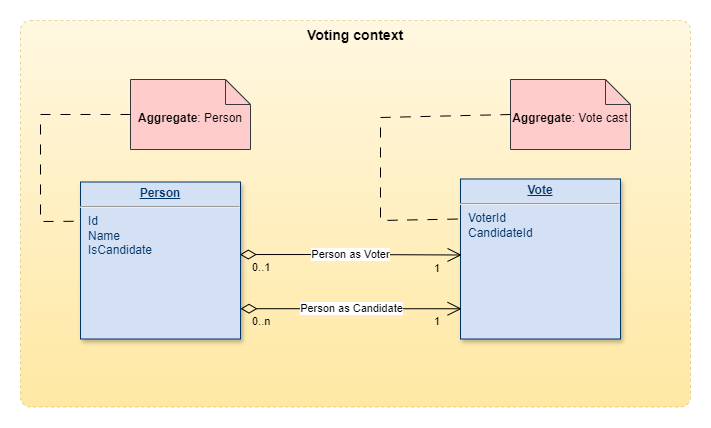
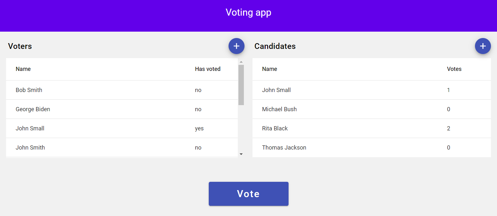

# Voting application
A sample WEB application presenting some practises that I use in projects. This is a voting application that allows users to vote for candidates. The application enables adding new candidates, managing voters, and tracking the number of votes cast.

## Features
- Add new candidates to the list.
- Display the list of candidates with the number of votes they received.
- Add new voters to the list.
- Allow users to cast votes.
- Display a list of voters with information indicating whether a user has already voted.

Some additional descriptions are provided in the codebase and are denoted with the text **[DESC]** so they can be easily found.

### Domain Model
Below is the domain model of the application, showing entities and relationships between them:


### Application UI View
Below is a main view of the application user interface:


# How to run the application

## Development environment on local machine

### Requirements
- Node.js v.18
- .NET Core SDK v.6
- npm (Node Package Manager)
- SQL Server min v.2017

### Back-end
1. Run SQL Server and create a data base with name: _VoteApp_
2. Clone the repository (or download content of the repository).
3. Navigate to the project directory: _VoteAppApi\VoteApp.Api_ and verify data base connection string (port, user, password) in appsettings.json file according to the SQL Server configuration.
4. Run the application using the .NET CLI:
```
dotnet run
```
### Front-end
1. Navigate to the frontend directory: _VoteApp_ and install the required packages:
```
npm install
```
2. Run the Angular application:
```
ng serve
```
3. Open your web browser and go to http://localhost:4200

## DOCKER containers

### Requirements
- **Docker**: [Install Docker](https://docs.docker.com/get-docker/)
- **Docker Compose**: [Install Docker Compose](https://docs.docker.com/compose/install/)

1. Clone the repository (or download content of the repository)
2. Run the application using Docker Compose:
```
docker-compose -p vote-app up --build
```

# Technology Stack

### Front-end

- **Angular v. 15**: A JavaScript framework for building single-page applications.
- **TypeScript**: A superset of JavaScript that adds typing and other features.
- **Angular Material**: A UI component library for creating modern, responsive user interfaces.
- **HTML/SCSS**: Structure and styling of the application.

### Back-end

- **.NET Core v. 6**: A platform for building scalable and high-performance web applications.
- **Entity Framework Core**: An ORM for managing relational databases.
- **CQRS with MediatR**: A pattern for separating command and query responsibilities using the MediatR library.
- **Microsoft SQL Server**: A realtional database used to store application data.

## Unit Tests

The application includes sample unit tests written using the **NUnit** framework.

To run the tests, navigate to the test project directory: _VoteAppApi\VoteApp.Application.Tests_ and use the following command in your terminal:

```
dotnet test
```


